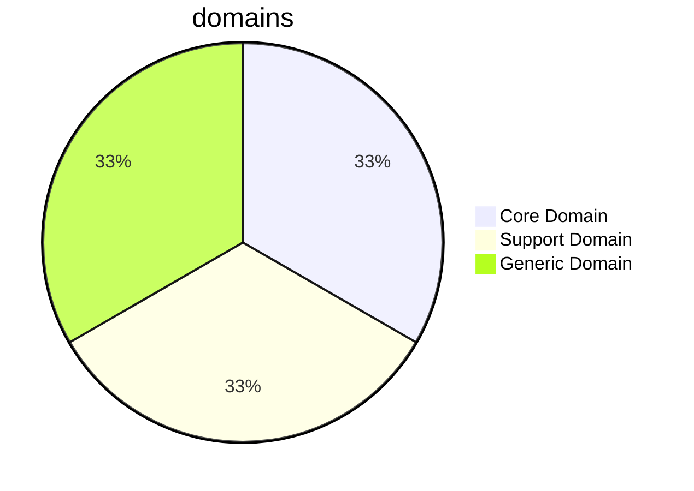
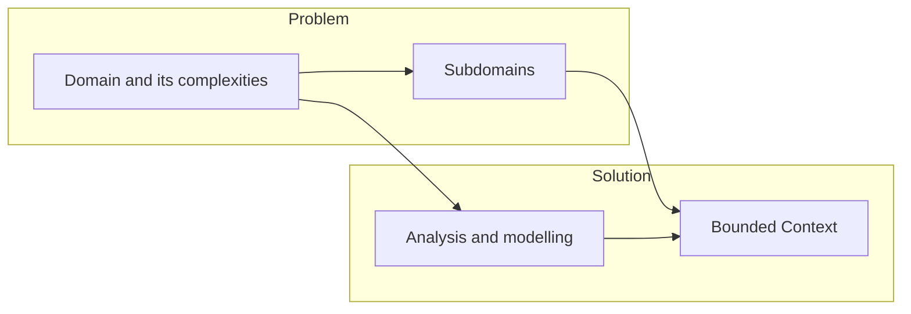
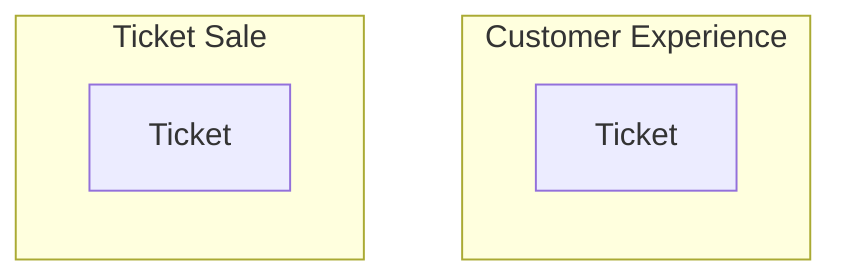
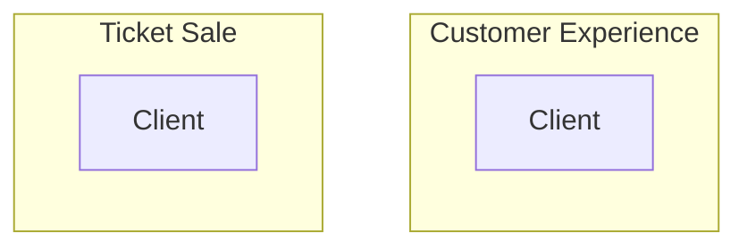
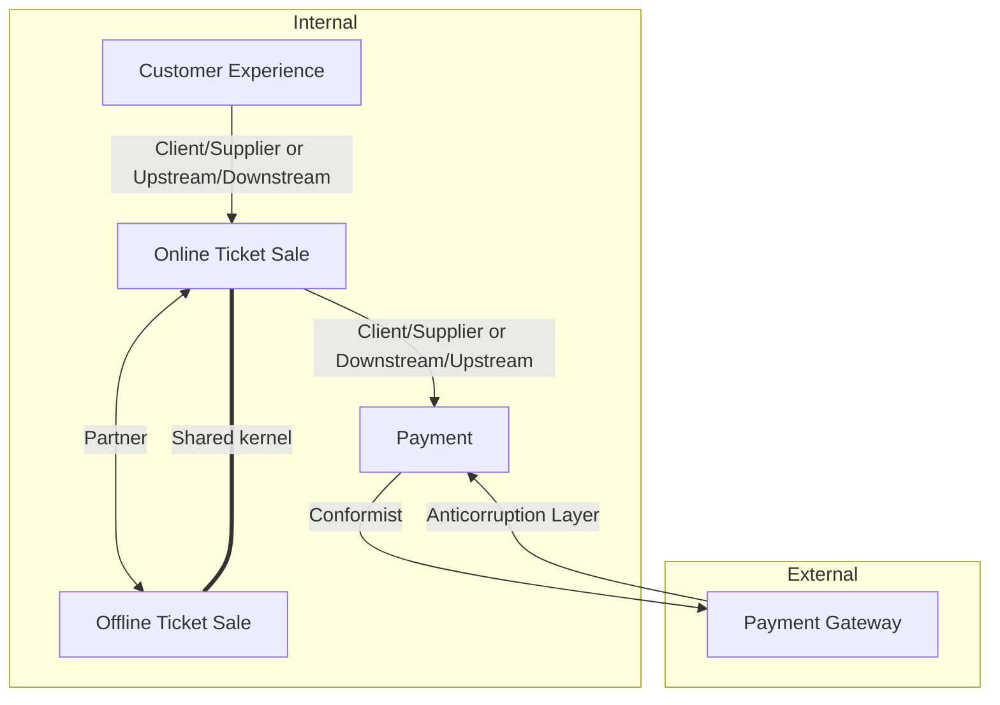
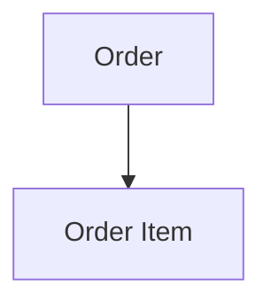
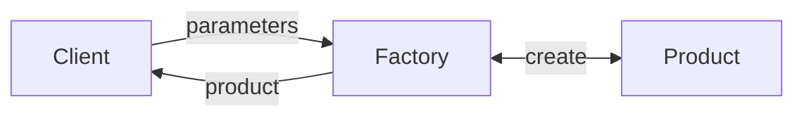
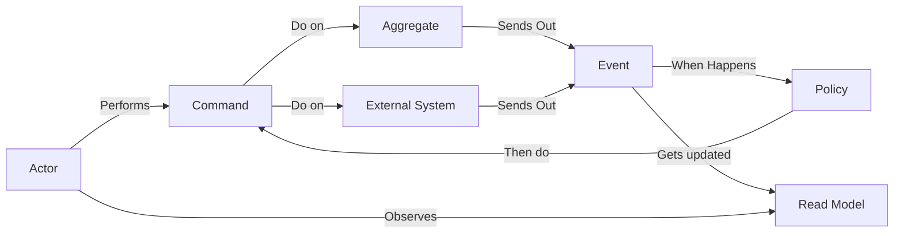
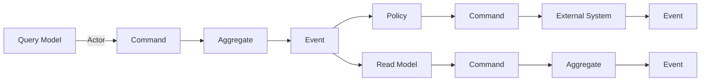

# ddd-full-cycle - 2023-06-29 22:47:08.838276273 -0300 -03 m=+0.012408418

> DDD is about modelling a ubiquitous language in a bounded context

- Important to have a ubiquitous language to understand the business model of a company (Client x User x Customer x Store)

## Domain and subdomains



- Core domain: **Competitive advantage of the company** and **Heart of the business**
- Support domain: **Support the core domain** and **Make the operation possible**
- Generic Domain: **Generic and common to all companies**

**Some companies make the 'generic' domain as a core domain, and sells to other companies**

## Problem Space and Solution Space

When facing a new problem we usually can start by understanding the problem and breaking it down into smaller problems.

Find a problem -> Understand the problem -> Break it down into smaller problems -> Limit the scope in a solvable problem -> Solve all problems



## Bounded Contexts

> A bounded context is an explicit boundary within which a domain model exists. Inside the boundary all terms
> and phrases of the ubiquitous language have specific meaning, and the model reflects the language with exactness.

In a **bounded context** the same thing can have many meanings, depending on the context. Generally, a company with
multiple departments will have multiple different meanings for the same thing.





- **Same word** with **different meanings**
- **Different words** with **same meaning**
- **Same word** with **same meaning** but **different contexts**

### Bounded contexts and 50 columns tables

It's common to see tables with 50 columns, because it's a mix of different contexts. Some columns are for
customer experience, others are for sales and so on. We should split this table into multiple tables, one for
each bounded context

## Context Mapping



- Teams for each context (creates a ubiquitous language for each context)

### Patterns

[Context Mapping DDD Crew - Github](https://github.com/ddd-crew/context-mapping)

- Partnership ( partnership in the business)
- Shared kernel ( shared library )
- Customer-Supplier (Upstream-Downstream) ( one team supplies something to another team )
- Conformist ( one team conforms to another team )
- Anti-corruption layer ( one team protects itself from another team )
- Open Host Service ( one team exposes a service to another team )
- Published Language ( one team publishes a language to another team )
- Separate Ways ( one team splits into two teams )
- Big Ball of Mud ( one team is a big ball of mud )

---

# Tactical Elements

Elements capable of solving problems in a **bounded context**

## Entity

[[1cur]]

### Anemic Domain Model

Domain model with no behaviour, modelled to be persisted in a database. When
using an ORM, we usually model our entity to match our database, and not the
as a domain model.

Entities should have behaviour, and not only data. Every change in an entity
should come from a method of the entity itself.

### Business Rules

Business rules express the business logic of a system. E.g. a customer
can have an attribute active, and this attribute can be true or false. But
in a DDD way, we should have an activate and deactivate method, to express
the change in state, instead of just updating the database. Expressiveness
in the way we model our system.

Ensures that the current state of the entity is always valid. E.g. a customer
should not be built without the required attributes. If we try to build a
customer without a name, we should receive an error.

### Auto-validation principle

An entity should always be valid, and should not be persisted in an invalid. Every single method should correlate to an business rules and ensure that the validations required to perform the action are valid.

### Entity vs ORM

Having 2 entities, one for the domain and one for the ORM, is a good practice. This way we can have a clean separation between the domain and the persistence layer. The domain entity should be responsible for the business rules, and the ORM entity should be responsible for the persistence.

#### Infra x Domain

Business Complexity: Domain (DDD)
Entity: Customer

Accidental Complexity: Infra (ORM)
Model/Entity: Customer

### Hands-on

```typescript
class Customer {
  _id: string;
  _name: string;
  _address: string = "";
  _active: boolean = false;

  constructor(id: string, name: string) {
    this._id = id;
    this._name = name;
    this.validate();
  }

  validate() {
    if (this._name.length === 0) {
      throw new Error("Name is required");
    }
    if (this._id.length === 0) {
      throw new Error("ID is required");
    }
  }

  changeName(name: string) {
    this._name = name;
    this.validate();
  }

  activate() {
    if (this._address.length === 0) {
      throw new Error("Address is required to activate customer");
    }
    this._active = true;
  }

  deactivate() {
    this._active = false;
  }
}
```

## Value Objects

Getting out of the primitive types mindset with value objects. Value objects
are objects that have no identity, and are immutable. Having rules on their own
and validations on their own (Screaming Architecture)

Value objects are immutable, and should be treated as such. We should not change their attributes, but instead create new value objects with the new values.

Self-validating objects without an ID

### Why use value objects, instead of primitives?

A software that talks a lot with the 'outside', is unstable, because any change
can impact directly on the 'inside' world. Making the software more stable, we
can use our own types (value objects) to communicate with the outside world

### Hands-on

```typescript
class Address {
  _street: string = "";
  _number: number = 0;
  _city: string = "";
  _zipCode: string = "";

  constructor(street: string, number: number, zipCode: string, city: string) {
    this._street = street;
    this._number = number;
    this._zipCode = zipCode;
    this._city = city;

    this.validate();
  }

  validate() {
    if (this._street.length === 0) {
      throw new Error("Street is required");
    }
    if (this._number === 0) {
      throw new Error("Number is required");
    }
    if (this._zipCode.length === 0) {
      throw new Error("Zip code is required");
    }
    if (this._city.length === 0) {
      throw new Error("City is required");
    }
  }

  toString() {
    return `${this._street}, ${this._number} - ${this._city} - ${this._zipCode}`;
  }
}
```

## Aggregates

Collection of associated objects that we treat as a unit for the purpose of data changes. The aggregate is responsible for ensuring that the state of the aggregate is always valid.

### Aggregate Root

Named after the root of a tree, the aggregate root is the entry point for all operations in the aggregate. It is the only object that is allowed to hold a reference to another aggregate root.



### Hands-on

```typescript
import OrderItem from "./order_item";

export default class Order {
  _id: string;
  _customerId: string;
  _items: OrderItem[] = [];

  constructor(id: string, customerId: string, items: OrderItem[]) {
    this._id = id;
    this._customerId = customerId;
    this._items = items;
  }
}

export default class OrderItem {
  _id: string;
  _name: string;
  _price: number;

  constructor(id: string, name: string, price: number) {
    this._id = id;
    this._name = name;
    this._price = price;
  }
}

import Customer from "./entity/customer";
import Address from "./entity/address";
import OrderItem from "./entity/order_item";
import Order from "./entity/order";

let customer = new Customer("1", "John");
const address = new Address("Rua 1", 123, "12345-123", "São Paulo");

customer.setAddress(address);
customer.activate();

const item = new OrderItem("1", "Item 1", 10);
const item2 = new OrderItem("2", "Item 2", 20);

const order = new Order("1", "1", [item, item2]);
```

### configuring jest project

```bash
yarn add -D jest @types/jest ts-jest
npx jest --init
```

### configuring swc

```bash
yarn add -D @swc/core @swc/jest @swc/cli
```

## Domain Services

> A service in the domain is a stateless operation that fulfills a domain-specific task. Often the best indication that you should create a Service in the domain model is when the operation you need to perform feels out of place as a method on an Aggregate (10) or a Value Object (6).

> When a process or transformation in the domain is not a natural responsibility of an Entity or Value Object, add an operation to the model as a standalone interface declared as a Service. Define the interface in terms of the language of the model and make sure the operation name is part of the Ubiquitous Language (2). Make the Service stateless.

Good examples of domain services are:

- Operation that involves multiple aggregates
- Operation that involves multiple entities, updating in batches
- Operation that calculates something based on multiple entities

Cautions:

- Many services can be a sign of a bad model
- Services should be stateless

## Repositories

> A repository refers to a place where data is stored. When you store something in the repository and later you retrieve it, you should get the same thing. This is the repository contract. The repository should have a consistent contract, no matter what the underlying storage is.

> Aggregate and repository have a one-to-one relationship (Order / OrderItem repository)

### Defining an interface

```typescript
export default interface RepositoryInterface<T> {
  create(entity: T): Promise<void>;
  update(entity: T): Promise<void>;
  find(id: string): Promise<T>;
  findAll(): Promise<T[]>;
}
```

## Domain Events

> Use a Domain Event to capture an ocurrence within the domain

> The domain event essence is to capture things that can initiate a series of changes in the application state. This event objects are processed
> to produce side effects in other parts of the system and audit the application state (AuditLog).

- All events should be represented by a **past action** (UserCreated, OrderPlaced, EmailSent)
- The domain event should be immutable, and should not have setters. The only way to change the state of the event is by creating a new one.
- The main objective of an event is to notify other bounded contexts, decoupling the system. The invoice service does not need to know about the order service, it only needs to know that an order was placed.

### Components

- Event: The event itself
- Handler: The handler is responsible for handling the event. It can be an event handler, a command handler, a saga, etc.
- Dispatcher: The dispatcher is responsible for dispatching the event to the handler. It can be a synchronous or asynchronous dispatcher.

### How does it work?

- Create an event dispatcher
- Create an event
- Create a handler for the event
- Register the event handler in the dispatcher
- Dispatch the event and send a `notify` method to the all handlers

## Modules

Modules are containers named after domain objects that are coherent between them. The objective with modules is to create a **high cohesion** between the domain objects and **low coupling**
Modules are used in DDD as a way to organize the code. Each module is a container for domain objects, repositories, services, events, etc.

They enable creating multiple objects with similar names that build different stuff. As Sales::Product, Inventory::Product

- Respect the ubiquitous language
- Low coupling
- One or more aggregates, only if they are highly related
- Organize by the domain/sub-domain, not the object ( Product/Inventory x Controller/Model )
  - Modules start from the bounded context (Checkout bounded context have the order, product modules)
- Respect the same level of abstraction (all modules should be at the same level of abstraction)

### Modules vs Bounded Context

A bounded context can have many modules, but a module can only be part of one bounded context.
E.G. **Sales bounded context with product module and order module.**

## Factories

> Delegate the responsibility of creating complex objects to a factory, the factory does not have the responsibility in the domain model, but it is part of the domain model design.
> Supply a interface that encapsulates all the complex logic and does not require the client to specify the concrete class of the object that will be created.
> The client is not responsible for knowing which concrete class to instantiate.

- Only instantiate the object in the factory
- Does not need to know the concrete class, only the input received
- Decides what concrete class to instantiate based on the input received with a common interface (Product with 110V in BR, 220V in US)



### Factory Method vs Abstract Factory

- Factory Method: Single method that creates objects with the same interface
- Abstract Factory: Family of related objects, with different interfaces

# Event Storming

- Tactical pattern in DDD

A dynamic workshop that allows us to explore complex business domains through collaborative modeling.
It is a visual approach that allows us to explore the business domain from different perspectives.

If you map everything that happens in the system, you understand every process in the system.

## Events

Everything that happened in the system is an event. Events are always in the past tense.

- Orange sticky notes
- Result of an action
- Verb at past tense
- Relevant for domain experts

### Finalized process

- Bigger event post-it indicates the end of the process

## Commands

- Blue sticky notes
- Executes an action
- Verb at imperative
- Relevant for domain experts

## Persona

- Yellow sticky notes
- Who is doing the action
- The persona is a role, not a person

## Read model

- Green sticky notes
- Responsible for reading the data from the system
- Data needed in order to make decisions
- API / Queue / Database

## Policy

- Pink sticky notes
- Whenever something happens, something else should happen
- Can be automated or manual
- Similar to callbacks

## Timeline

- Helps to understand the order of things

## Events Origin

- Action from a persona
- Action from a external system (webhook)
- Action from scheduled job (cronjob)
- Action from consequence of a policy

## Aggregates

- Between a command and an event, there is an aggregate
- Represents a business transaction with business rules
- Allows to understand better and create the aggregates based on the events and commands

## Pivotal Events

- Events that symbolize the most important part of the system
- Events that glue the system together, bounded contexts
- Helps identify gray areas in the system

## Risks and Opportunities

When is identified a gray area in the system, it means that there is a risk or an opportunity.

- Risk: Something that can go wrong
  - Hotspot
- Opportunity: Something that can be improved
  - Upselling

## Arrow Voting

When dealing with hotspots, we can make a group vote to find the most important hotspots.

## Flow model



## Flow of time



https://whimsical.com/event-storming-LR9ex19rzbFaq4o2yEo9DQ
