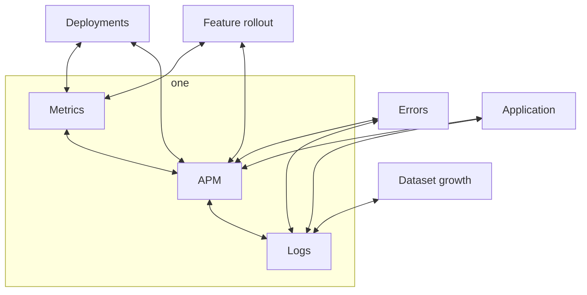

# Rails performance guidebook by zendesk - 2023-05-15 00:41:30.843826879 -0300 -03 m=+3467.675598843

tags: #ruby #performance #talks 

## Monitoring



## Use db indexes

```ruby
class AddIndexToComments < ActiveRecord::Migration[6.1]
  def change
    add_index :comments, :post_id
  end
end
```

*   Don't assume that the database will use the
    right index for you

## Use `explain` to check the query plan

```ruby
Comment.where(post_id: 1).explain
```

## Greedy Selects

```ruby
class Post < ApplicationRecord
  has_many :comments
end

class Comment < ApplicationRecord
  belongs_to :post
end

post = Post.first
post.comments

# SELECT "comments".* FROM "comments" 
# WHERE "comments"."post_id" = ?  [["post_id", 1]]
```

When using greedy selects you are loading all the
comments for the post, even if you don't need them.
If this table reaches 40+ columns, your memory probably
won't be able to handle it and it you start to write
to disk.

## Caching

*   Using for normalized data.

E.g. in a ticket, you need to know the last comment
of a user called `Felipe`. You can cache this data
in the ticket model.

### Is 40ms a lot?

*   `40 ms * 50000 req/day * 365 days = 8 full days`

### Complex DB queries

Highly complex queries have high variability.
That means that the median time is slower than 1%

Caching is a good idea for complex queries.
Because it increases the p99, improving the user
experience.

*   We use redis as an infinite cache. In reality
    it has a limit, so use wisely.

## Cold Storage

*   Use cold storage for data that you don't need, archived
    data, etc.

Tradeoff: Multiple datasources increase complexity.

## Heavy endpoints

*   Slower endpoints
*   Heavier payloads
*   Increased Complexity

Solutions: Sideload, GraphQL

## Divide data into multiple requests

*   Use pagination
*   Use GraphQL
*   Multiple requests with different endpoints
    so users have functionality ASAP

## Async requests vs Sync requests

*   Async requests are better for the user experience
    in distributed systems.

## An excessive persuit of perfection can be counterproductive
