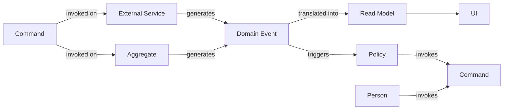

# Arkency Strategic DDD  - 2023-05-16 21:13:32.839843479 -0300 -03 m=+0.011596628

#fleeting
#arkency

## How can business, engineers and sales communicate each other with different jargon's?

*   Having many people involved in a project can result in misleading connotations to what
    the project achieves or is trying to achieve.
*   Having it's own jargon's means having a communication barrier in the output of a system
*   Translating a text to another language, then translating it back to the original gives a
    different output to the input it was given

**Having a common vocabulary between all terms used in a model (names of classes,
prominent operations).**

***

## How can we determine a language?

*   Model Exploration Whirlpool
*   Event Storming
*   Domain Storytelling

**Using domain discovery techniques we can achieve a common language between all of the peers in the project**

***

## How one can ensure the are not barriers in the communication

*   Weaknesses open up when we try to find new words to awkward terms & combinations
*   Language is build within day-to-day discussions and per contexts of the team

**Forcing everyone in the team to use the same words when entering a discussion. Having a common
vocabulary when discussing problems within the context of the project**

***

# Event Storming

## How can someone learn about a domain when having very little to no experience in the subject?

*   Event Storming is a technique to learn about the domain, with very little or none knowledge on the domain
*   Domain Experts are people with answers about the questions in the domain
*   Chaotic and unstructured, but it's a good thing, beats sequential and structured
*   Throw away model, it's not a model, it's a tool to learn about the domain

**Using simple notations to model the problem with sticky notes**

## Dictionary

*   **Domain Events**: Sentence described in the past tense, describing something that happened in the domain
*   **Commands**: Sentence described in the imperative tense, describing something that should happen in the domain
*   **Aggregate**: A group of objects that are treated as a single unit
*   **Event Storming**: A technique to learn about the domain, with very little or none knowledge on the domain
*   **Domain Experts**: People with answers about the questions in the domain

