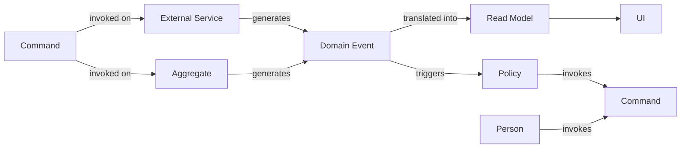

# Event Storming - 2023-06-14 19:40:57.812841029 -0300 -03 m=+2841.208673031

### How can someone learn about a domain when having very little to no experience in the subject?

*   Event Storming is a technique to learn about the domain, with very little or none knowledge on the domain
*   Domain Experts are people with answers about the questions in the domain
*   Chaotic and unstructured, but it's a good thing, beats sequential and structured
*   Throw away model, it's not a model, it's a tool to learn about the domain

**Using simple notations to model the problem with sticky notes**, also using
[Ubiquitous Language](6505) to describe the problem.

## Dictionary

*   **Domain Events**: Sentence described in the past tense, describing something that happened in the domain
*   **Commands**: Sentence described in the imperative tense, describing something that should happen in the domain
*   **Aggregate**: A group of objects that are treated as a single unit
*   **Event Storming**: A technique to learn about the domain, with very little or none knowledge on the domain
*   **Domain Experts**: People with answers about the questions in the domain
